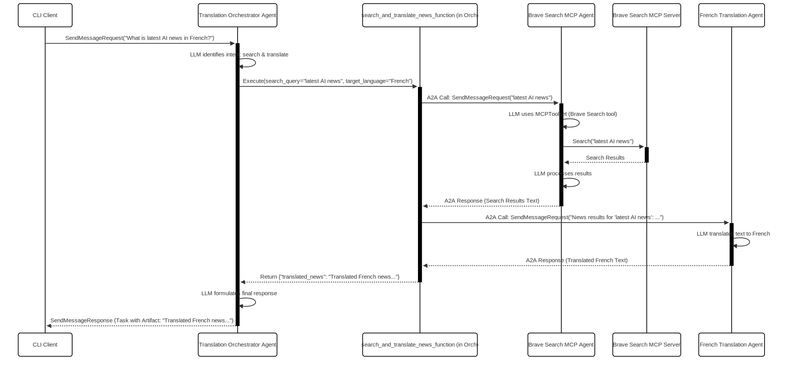

# Building a Sophisticated Multi-Agent System for Information Retrieval and Translation

This article details the architecture and implementation of a multi-agent system designed to fetch information using web search and translate it into specified languages. The system leverages the Google Agent Development Kit (ADK) for agent creation, the Agent-to-Agent (A2A) communication protocol for inter-agent messaging, and the Model Context Protocol (MCP) for integrating external tools like Brave Search.

## System Overview

The system comprises four distinct agents and a command-line interface (CLI) client:
1.  **Translation Orchestrator Agent**: The central coordinator that receives user requests, determines the required actions (search, translation, or both), and delegates tasks to specialized sub-agents.
2.  **Spanish Translation Agent**: A specialized agent responsible for translating text into Spanish.
3.  **French Translation Agent**: A specialized agent responsible for translating text into French.
4.  **Brave Search MCP Agent**: An agent that interfaces with the Brave Search API via MCP to perform web searches.
5.  **CLI Client**: A command-line tool for users to interact with the Translation Orchestrator Agent.

This setup allows for a modular and scalable approach where each agent focuses on a specific task, and the orchestrator manages the overall workflow.

### System Architecture Diagram

## Core Technologies

-   **Google Agent Development Kit (ADK)**: Used for building the core logic of each agent, particularly `LlmAgent` for language model interactions and tool usage. ADK simplifies the creation of agents that can understand natural language, use tools, and maintain memory.
-   **Agent-to-Agent (A2A) Python SDK**: Facilitates communication between the orchestrator and the sub-agents. It provides a standardized way for agents to send messages, manage tasks, and exchange data, regardless of their internal implementation.
-   **Model Context Protocol (MCP)**: Enables the Brave Search Agent to interact with the external Brave Search MCP server. MCP allows agents to discover and use tools from external services (MCP Servers) in a standardized manner, abstracting the direct API calls.
-   **Large Language Models (LLMs)**:
    -   Google Gemini models (e.g., `gemini-2.0-flash`) are used for the Orchestrator, French Translation, and Brave Search agents due to their strong instruction-following and function-calling capabilities.
    -   LiteLLM (with OpenAI's GPT-3.5 Turbo) is used for the Spanish Translation Agent, showcasing the flexibility to integrate various LLM providers.
-   **Python**: The primary programming language for all components.
-   **Uvicorn & Starlette**: For running the A2A web servers that expose each agent's capabilities.

## Agent Deep Dive

Each agent in the system has a specific role and is built using a common set of patterns.

### 1. Translation Orchestrator Agent

The Translation Orchestrator is the brain of the system. It processes user queries, understands the intent (e.g., simple translation vs. search then translate), and coordinates the workflow by delegating tasks to the appropriate sub-agents using function tools.

**Directory:** `a2a-python/examples/google_adk/translation_orchestrator_agent/`

**Key Files:**

*   **`__main__.py`**:
    *   **Purpose**: This script is the entry point for starting the Orchestrator Agent's A2A server.
    *   **Functionality**:
        *   Loads environment variables (e.g., `GOOGLE_API_KEY` for its own LLM).
        *   Defines `AgentSkill`s: These describe the orchestrator's high-level capabilities to potential clients. For this agent, skills include "Translate to Spanish," "Translate to French," and "Search and Translate News."
        *   Initializes the `ADKTranslationOrchestratorAgentExecutor`, which contains the agent's core A2A processing logic.
        *   Creates an `AgentCard`: This card is a standardized way to publish the agent's metadata (name, description, URL, version) and its skills.
        *   Sets up an `A2AStarletteApplication` using the `AgentCard` and a `DefaultRequestHandler`. The request handler uses the agent executor to process incoming A2A requests.
        *   Starts the Uvicorn server, making the agent accessible over HTTP (default port: 10012).

*   **`adk_agent.py`**:
    *   **Purpose**: Defines the core ADK `LlmAgent` that powers the orchestrator's decision-making.
    *   **Functionality**:
        *   The `create_translation_orchestrator_agent` function initializes an `LlmAgent` configured with a Gemini model (`gemini-2.0-flash`).
        *   **Instruction Prompt**: A detailed instruction prompt is provided to the LLM. This prompt guides the LLM on how to:
            *   Interpret user queries.
            *   Identify the user's intent (direct translation or search & translate).
            *   Extract necessary parameters (text for translation, search query terms, target language).
            *   Crucially, it instructs the LLM to **always** use one of the provided function tools for specific tasks rather than attempting to perform them directly.
        *   **Tools**: The agent is equipped with three Python functions registered as tools:
            *   `translate_to_spanish_function`
            *   `translate_to_french_function`
            *   `search_and_translate_news_function`
            ADK automatically wraps these Python async functions (with type hints and docstrings) into `FunctionTool` objects that the LLM can invoke.

*   **`a2a_translation_tools.py`**:
    *   **Purpose**: This file contains the actual Python implementations of the function tools used by the Orchestrator's LLM.
    *   **Functionality**:
        *   `_call_a2a_agent(agent_url, agent_id, message_text)`: A private helper async function that encapsulates the logic for making an A2A call to another agent. It constructs an `A2AClient`, sends a message containing `message_text`, and polls the target agent's task endpoint until the task is completed, returning the text from the first artifact.
        *   `translate_to_spanish_function(text_to_translate: str, original_user_query: str)`:
            *   Its docstring and type hints guide the LLM on when and how to use it.
            *   Calls `_call_a2a_agent` to delegate the `text_to_translate` to the Spanish Translation Agent (running on port 10010, ID `spanish_translator`).
            *   Returns a dictionary: `{"translated_text": "..."}`.
        *   `translate_to_french_function(text_to_translate: str, original_user_query: str)`:
            *   Similar to the Spanish function, but targets the French Translation Agent (port 10011, ID `french_translator`).
            *   Returns `{"translated_text": "..."}`.
        *   `search_and_translate_news_function(search_query: str, target_language: str, original_user_query: str)`:
            *   This multi-step tool first calls the Brave Search MCP Agent (port 10009, ID `mcp_brave_search_agent_adk`) via `_call_a2a_agent` with the `search_query`.
            *   After receiving the search results (news content), it determines the `target_language`.
            *   It then calls either `translate_to_spanish_function` or `translate_to_french_function` (internally, these will make further A2A calls) with the retrieved news content as `text_to_translate`.
            *   Returns a dictionary: `{"translated_news": "..."}`.

*   **`adk_agent_executor.py`**:
    *   **Purpose**: This class implements the A2A SDK's `AgentExecutor` interface, acting as the bridge between the A2A server infrastructure and the ADK-based agent logic.
    *   **Functionality**:
        *   In its `__init__`, it creates an instance of the `LlmAgent` (defined in `adk_agent.py`) and an ADK `Runner`. The `Runner` is responsible for executing the agent's logic, including tool calls.
        *   The `execute` method is called by the A2A request handler when a new message arrives. It:
            *   Initializes a `TaskUpdater` to report progress.
            *   Converts the incoming A2A message parts into the `google.genai.types.Content` format expected by the ADK `Runner`.
            *   Calls `self._process_request`, which in turn calls `self.runner.run_async()`.
        *   `_process_request` asynchronously iterates through events generated by the ADK `Runner`:
            *   **Function Calls**: If the LLM decides to use a tool (e.g., `search_and_translate_news_function`), an event with function call details is generated. ADK's `AutoFlow` mechanism automatically executes the corresponding Python function from `a2a_translation_tools.py`. The result of this function is then fed back to the LLM in a subsequent turn. The executor logs these calls.
            *   **Interim Responses**: If the LLM generates intermediate text, it's sent as a task update.
            *   **Final Response**: When the LLM produces its final response (after all tool calls are resolved and their outputs processed by the LLM), this event is caught. The content is converted back to A2A `Part`s, added as an `Artifact` to the task, and the task is marked as `completed`.

### 2. Translation Sub-Agents (Spanish & French)

These agents are specialized, single-purpose agents. The French and Spanish agents are structurally very similar, with the main difference being the LLM used and the target language in their prompts. We'll use the French agent as an example.

**Directory (French):** `a2a-python/examples/google_adk/french_translation_agent/`
(Spanish agent is in `a2a-python/examples/google_adk/spanish_translation_agent/`)

**Key Files:**

*   **`__main__.py`**:
    *   **Purpose**: Starts the A2A server for the French Translation Agent (runs on port 10011).
    *   **Functionality**: Similar to the orchestrator's `__main__.py`, it defines an `AgentSkill` ("Translate to French"), an `AgentCard`, initializes `ADKFrenchTranslationAgentExecutor`, and starts the Uvicorn server. The Spanish agent's `__main__.py` is analogous, running on port 10010.

*   **`adk_agent.py`**:
    *   **Purpose**: Defines the ADK `LlmAgent` for French translation.
    *   **Functionality**:
        *   Initializes an `LlmAgent` with a Gemini model (`gemini-1.5-flash`).
        *   The instruction prompt is simple: "You are a translation assistant. The user will provide text. Translate the provided text into French. Only return the translated French text..."
        *   `tools=[]`: This agent does not need any external tools; its LLM performs the translation directly.
        *   The Spanish agent's `adk_agent.py` is similar but configured to use `LiteLlm(model="openai/gpt-3.5-turbo")` and prompted for Spanish translation.

*   **`adk_agent_executor.py`**:
    *   **Purpose**: Implements the A2A `AgentExecutor` for the French translation agent.
    *   **Functionality**:
        *   Initializes its specific `LlmAgent` and ADK `Runner`.
        *   When its `execute` method is called (by the orchestrator via an A2A request), it runs its LLM with the provided text.
        *   The `_process_request` method waits for the `event.is_final_response()` from its LLM, which contains the translated text. This response is then converted into an A2A `Artifact` and the task is completed.

### 3. Brave Search MCP Agent

This agent acts as an A2A-compliant wrapper around an MCP server that provides Brave Search functionality.

**Directory:** `a2a-python/examples/google_adk/mcp_brave_search_agent/`

**Key Files:**

*   **`__main__.py`**:
    *   **Purpose**: Starts the A2A server for the Brave Search Agent (runs on port 10009).
    *   **Functionality**: Standard A2A server setup: defines an `AgentSkill` ("Brave Search"), `AgentCard`, initializes `ADKBraveSearchAgentExecutor`, and starts Uvicorn. Requires `BRAVE_API_KEY` to be set in the environment.

*   **`adk_agent.py`**:
    *   **Purpose**: Defines the ADK `LlmAgent` that uses the Brave Search MCP tool.
    *   **Functionality**:
        *   Initializes an `LlmAgent` with a Gemini model.
        *   The instruction prompt guides the LLM to use the "Brave Search tool" when it needs to find information.
        *   **`tools=[MCPToolset(...)]`**: This is the key integration point.
            *   An `MCPToolset` is provided, configured with `StdioServerParameters`. These parameters tell ADK how to start and manage the Brave Search MCP server as a subprocess (`npx -y @modelcontextprotocol/server-brave-search`).
            *   The `BRAVE_API_KEY` is passed as an environment variable to this subprocess.
            *   ADK's `MCPToolset` automatically discovers the tools offered by this MCP server (e.g., a tool like `brave_web_search`) and makes them available to the `LlmAgent`.

*   **`adk_agent_executor.py`**:
    *   **Purpose**: Implements the A2A `AgentExecutor` for the Brave Search agent.
    *   **Functionality**:
        *   Initializes its `LlmAgent` (which includes the `MCPToolset`) and ADK `Runner`.
        *   When its `execute` method is called (e.g., by the orchestrator with a search query), it runs its LLM.
        *   The LLM, following instructions, makes a function call to the Brave Search tool (e.g., `brave_web_search`) provided by the `MCPToolset`.
        *   The `MCPToolset` handles the communication with the underlying Brave Search MCP server (which it manages).
        *   Search results from the MCP server are returned to the `MCPToolset`, then to the LLM.
        *   The LLM processes these results and formulates a final textual answer.
        *   The `ADKBraveSearchAgentExecutor` takes this final LLM response, converts it to an A2A `Artifact`, and completes its task.

### 4. CLI Client

**File:** `a2a-python/examples/google_adk/translation_orchestrator_agent/cli_client.py`

*   **Purpose**: A simple command-line interface for users to interact with the Translation Orchestrator Agent.
*   **Functionality**:
    *   Accepts a `--query` argument from the user (e.g., "What is the latest AI news in French?").
    *   Uses the `A2AClient` from the A2A SDK to send a `SendMessageRequest` to the configured Orchestrator Agent's URL (default `http://localhost:10012`).
    *   Upon receiving a `SendMessageSuccessResponse` containing a `Task` object, it extracts the `task.id`.
    *   It then enters a loop, polling the orchestrator's `getTask` endpoint with the `task.id` until the task's state is `completed`, `failed`, or `canceled`.
    *   It prints any interim messages received during polling and, finally, the content of the text artifacts from the completed task.

## A2A Communication Components Explained

The A2A Python SDK provides the building blocks for creating these interoperable agents. Let's look at the French Translation Agent's `__main__.py` as an example to understand these components:

1.  **`A2AStarletteApplication(agent_card, request_handler)`**:
    *   This class from `a2a.server.apps` is the main entry point for creating an A2A-compliant web server using the Starlette ASGI framework.
    *   It takes an `AgentCard` instance (describing the agent) and a `request_handler` instance (defining how to process requests).

2.  **`AgentCard`**:
    *   Defined in `a2a.types`, this Pydantic model holds metadata about the agent.
    *   Key fields include `name`, `description`, `url` (the agent's own endpoint), `version`, `defaultInputModes` (e.g., `['text']`), `defaultOutputModes` (e.g., `['text']`), `capabilities` (e.g., `streaming=True`), and a list of `AgentSkill` objects.
    *   The `AgentCard` is typically made available at a `/.well-known/agent.json` endpoint, allowing other agents or clients to discover its capabilities.

3.  **`DefaultRequestHandler(agent_executor, task_store)`**:
    *   A convenient, pre-built request handler from `a2a.server.request_handlers`.
    *   It implements the A2A JSON-RPC specification, mapping incoming method calls (like `sendMessage`, `getTask`) to the appropriate methods on an `agent_executor` and interacting with a `task_store`.

4.  **`AgentExecutor` (implemented by `ADKFrenchTranslationAgentExecutor`)**:
    *   This is an interface defined in `a2a.server.agent_execution`. Our custom `ADKFrenchTranslationAgentExecutor` class implements this interface.
    *   The most important method is `async def execute(self, context: RequestContext, event_queue: EventQueue)`. This method is invoked by the `DefaultRequestHandler` when a `sendMessage` request is received.
    *   It contains the core business logic of the agent. In our ADK-based agents, this involves:
        *   Creating a `TaskUpdater` to publish events about the task's progress.
        *   Converting the A2A `Message` (from `context.message`) into the format expected by the ADK `Runner`.
        *   Running the ADK agent logic (e.g., `self.runner.run_async()`).
        *   Processing events from the ADK `Runner` and using the `TaskUpdater` to send back interim updates or final artifacts.

5.  **`InMemoryTaskStore()`**:
    *   An implementation of the `TaskStore` protocol (from `a2a.server.tasks`) that stores task information in memory.
    *   It's used by the `DefaultRequestHandler` and `TaskUpdater` to create, update, and retrieve task states and their associated artifacts. For production, a persistent task store (e.g., database-backed) would be more appropriate.

## End-to-End Workflow Example: "Latest AI News in French"

Let's trace the lifecycle of a user query: "What is the latest AI news in French?"

### Workflow Diagram: Search and Translate News

1.  **User Input**: The user executes the CLI:
    `uv run cli_client.py --query "What is the latest AI news in French?"`
    (This client is configured to target the Translation Orchestrator Agent on port 10012).

2.  **CLI to Orchestrator**: The `cli_client.py` constructs an A2A `SendMessageRequest` and sends it to the Translation Orchestrator Agent.

3.  **Orchestrator - Intent Recognition & Tool Selection**:
    *   The Orchestrator's `ADKTranslationOrchestratorAgentExecutor` receives the request.
    *   It invokes its ADK `LlmAgent` (Gemini model).
    *   The LLM processes the query based on its instructions and determines:
        *   **Intent**: Search for news and then translate.
        *   **Search Query Parameter**: "latest AI news"
        *   **Target Language Parameter**: "French"
        *   **Tool to Use**: `search_and_translate_news_function`

4.  **Orchestrator - Executes `search_and_translate_news_function`**:
    *   ADK's `AutoFlow` mechanism executes the selected Python function: `search_and_translate_news_function(search_query="latest AI news", target_language="French", original_user_query="What is the latest AI news in French?")`.

5.  **Inside `search_and_translate_news_function` (Step 1: Call Brave Search Agent)**:
    *   The function calls `_call_a2a_agent` targeting the Brave Search MCP Agent (on port 10009, agent ID `mcp_brave_search_agent_adk`) with the `message_text="latest AI news"`.

6.  **Brave Search Agent - Performs Search via MCP**:
    *   The `ADKBraveSearchAgentExecutor` receives the A2A request.
    *   It runs its ADK `LlmAgent`. This LLM is instructed to use its "Brave Search tool" (the `MCPToolset`).
    *   The `MCPToolset` facilitates a call to the `@modelcontextprotocol/server-brave-search` MCP server (managed by ADK).
    *   The MCP server executes the Brave Search and returns results.
    *   These results are passed back through the `MCPToolset` to the Brave Search Agent's LLM.
    *   The LLM processes these results and formulates a textual summary.
    *   The `ADKBraveSearchAgentExecutor` packages this summary as an A2A `Artifact` and completes its task.

7.  **Inside `search_and_translate_news_function` (Step 2: Receive Search Results)**:
    *   The `_call_a2a_agent` (within `search_and_translate_news_function`) receives the text artifact (the search results summary) from the Brave Search Agent. Example: "Recent AI developments include advancements in large language models and new ethical guidelines..."

8.  **Inside `search_and_translate_news_function` (Step 3: Call French Translation Agent)**:
    *   The function now calls `translate_to_french_function(text_to_translate="News results for 'latest AI news': Recent AI developments include...", original_user_query="What is the latest AI news in French?")`.
    *   This, in turn, uses `_call_a2a_agent` to send an A2A `sendMessage` request to the French Translation Agent (on port 10011, agent ID `french_translator`) with the (search result) text that needs translation.

9.  **French Translation Agent - Performs Translation**:
    *   The `ADKFrenchTranslationAgentExecutor` receives this request.
    *   It runs its ADK `LlmAgent` (Gemini model).
    *   The LLM translates the provided English search summary into French.
    *   The executor packages the French translation as an A2A `Artifact` and completes its task.

10. **Inside `search_and_translate_news_function` (Step 4: Receive Translated News)**:
    *   The `_call_a2a_agent` (nested within `translate_to_french_function`, called by `search_and_translate_news_function`) receives the translated text artifact.
    *   Example: "Résultats de l'actualité pour 'dernières nouvelles IA': Les développements récents de l'IA comprennent des avancées dans les grands modèles linguistiques et de nouvelles directives éthiques..."
    *   `search_and_translate_news_function` returns the dictionary `{"translated_news": "Résultats de l'actualité..."}`.

11. **Orchestrator - Final Response Formulation**:
    *   The dictionary result from `search_and_translate_news_function` is returned to the Orchestrator's LLM by ADK's `AutoFlow`.
    *   The Orchestrator's LLM, following its instructions, extracts the value associated with the "translated_news" key and formulates the final, user-facing natural language response.

12. **Orchestrator to CLI Client - Task Completion**:
    *   The `ADKTranslationOrchestratorAgentExecutor` takes this final LLM output, creates an A2A `Artifact` with it, and marks the orchestrator's main task as `completed`.
    *   The `cli_client.py`, which has been polling the `getTask` endpoint, receives the completed task status and the final artifact.
    *   The CLI client prints the translated news to the user's console.

## Conclusion

This multi-agent system effectively demonstrates how specialized agents can be composed to perform complex tasks like information retrieval and multilingual translation. Key to this architecture are:
-   **Modularity**: Each agent has a well-defined responsibility.
-   **Standardized Communication**: The A2A protocol ensures agents can interoperate seamlessly.
-   **Simplified Agent Development**: Google ADK streamlines the creation of LLM-powered agents and their ability to use tools.
-   **Extensible Tooling**: MCP allows for clean integration of external services like Brave Search without tightly coupling the agent to specific APIs.

This approach not only solves the immediate problem but also provides a robust framework for future extensions, such as adding more translation languages, integrating different information sources, or introducing new processing steps, simply by developing or configuring additional specialized agents and updating the orchestrator's logic.
